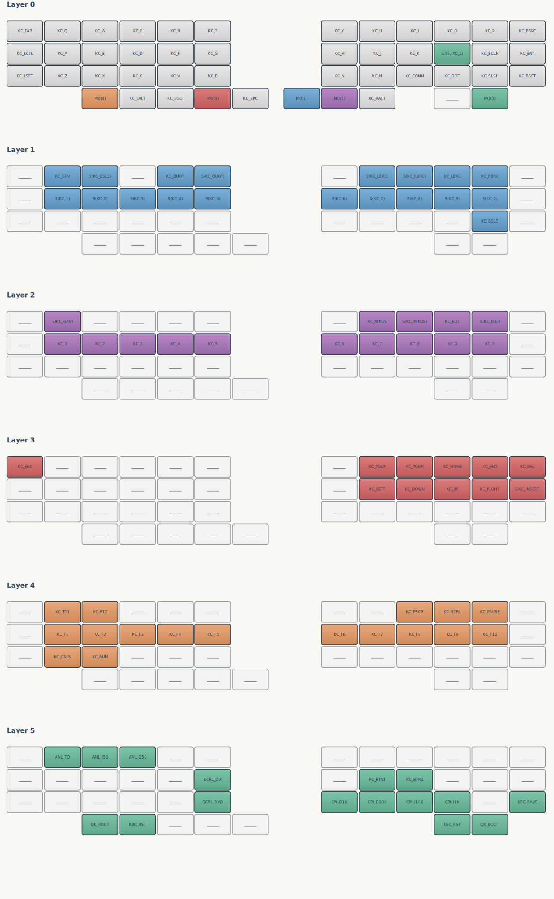

# keyball44-viz



This project implements a command line application that takes a [keyball44][1]
QMK `keymap.c` as input and produces a SVG visual representation of the
keymapping.

## Usage

Program usage is shown below:

```bash
A CLI tool to parse keyball44 QMK keymap files and output an SVG visualization

Usage: keyball44-viz [OPTIONS] <KEYMAP_FILE>

Arguments:
  <KEYMAP_FILE>  Path to the keymap.c file

Options:
  -s, --show-stats                 Display statistics about the keymap
  -o, --output-file <OUTPUT_FILE>  Output SVG file name
  -h, --help                       Print help
  -V, --version                    Print version
```

You can download precompiled binaries for Linux and Windows x86_64 from the
[releases page][2].

[1]: https://programmador.com/posts/2025/keyball44/
[2]: https://github.com/ivan-guerra/keyball44-viz/releases
